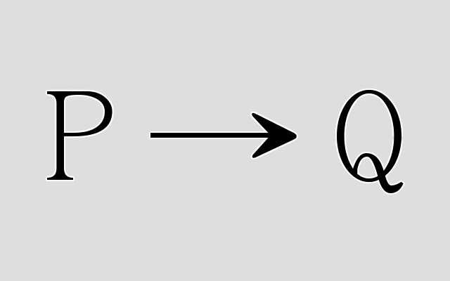

# Bivalence

Bivalence is a programming language designed to make writing programs more logical. Rather than try to prove your program is correct, your program proves to you if it is correct. Every expectation is checked during the runtime of the program, forcing your code to adapt to the unexpected.

# Contributing
Anyone is free to contribute. Please read [the guidelines](guidelines.org) before contributing.